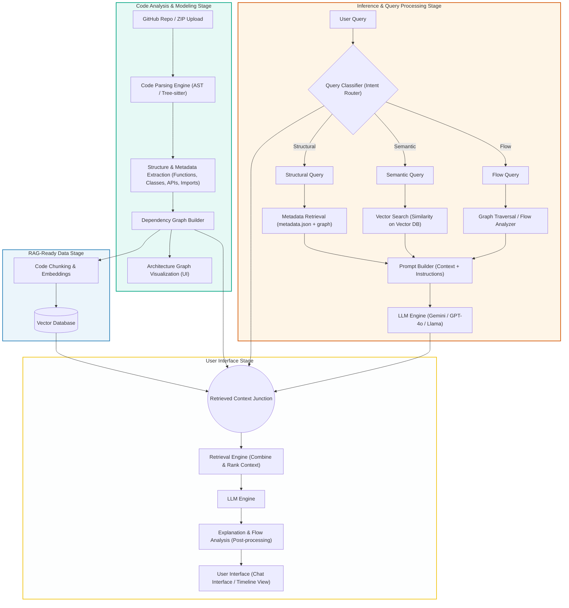

# System Architecture Document

## Project: CodeMap AI
**Sub-title:** High-Level Design, Data Flow, and Technology Stack Mapping

---

## 1. Core Pipeline Architecture

CodeMap AI executes a strict 4-stage ingestion, modeling, routing, and ranking pipeline to deliver highly context-accurate visualization and querying:



---

## 2. In-Depth Stage Walkthrough

### 2.1. Code Analysis & Modeling Stage (Ingestion)
1. **Repository Upload:** A user uploads a `.zip` archive or links a GitHub repository.
2. **Code Parsing (AST):** The parsing engine scans the codebase files using Abstract Syntax Tree (AST) or Tree-sitter models.
3. **Structure & Metadata Extraction:** Pulls parameters, imports, class hierarchies, functions, docstrings, and API routes.
4. **Dependency Graph Builder:** Establishes module-to-module import paths, class inheritance trees, and function calls.
5. **Visualization Viewport:** Feeds directly into the frontend **Architecture Graph Visualization** (using Cytoscape.js) to render file connections interactively.

### 2.2. RAG-Ready Data Stage (Vectorization)
1. **Code Chunking:** Chunks files down by function boundaries and class structures to preserve lexical context.
2. **Embedding Generation:** Converts code blocks into dense vector coordinates using Sentence-Transformers.
3. **Vector Database:** Local CPU-bound FAISS databases index the embeddings to prepare for similarity retrieval.

### 2.3. Inference & Query Processing Stage (Routing)
1. **User Input:** User submits a natural language question in the AI Chat.
2. **Intent Classification:** The **Query Classifier** checks if the request is:
   - **Structural:** Querying connections, imports, or files. Routed to **Metadata Retrieval** (reading `metadata.json` and NetworkX graph structures).
   - **Semantic:** Explaining files, methods, or databases. Routed to **Vector Search** (similarity query against local FAISS).
   - **Flow:** Tracking function hierarchies or request chains. Routed to **Graph Traversal / Flow Analyzer** (NetworkX path solving).
3. **Context Assembly:** The **Prompt Builder** collects the outputs from the respective handler, formats user inputs, and structures the prompt instructions.
4. **Context Prompting:** Sends formatted context to the key-rotated **LLM Engine** (Gemini / GPT-4o / Llama) to formulate a code-grounded answer.

### 2.4. User Interface Stage (Post-Processing & Output)
1. **Junction:** Merges classification metadata, vector database files, and LLM generated prompts.
2. **Retrieval Engine:** Combines and ranks retrieved context nodes to remove redundancy and sort by relevance.
3. **LLM Synthesis:** Synthesizes the ranked variables.
4. **Post-Processing:** Formats explanations and maps out timeline execution visuals.
5. **UI Rendering:** Outputs detailed text bubbles, markdown files, and flow timeline visualizations in the chat drawer.

---

## 3. Technology Stack Details

### 3.1. Frontend (Client)
- **Framework:** React 19 (Vite)
- **State & Routing:** React Router v7
- **CSS Styling:** Tailwind CSS v4
- **Visualization:** Cytoscape.js (with `cytoscape-dagre` for tree layouts, and `cytoscape-fcose` for force-directed networks)
- **Animations:** GSAP & GSAP React Hook (for UI transitions)
- **Scroll Kinetics:** Lenis (for modern smooth-scrolling experience)

### 3.2. Backend (Server)
- **Web Server:** FastAPI (Uvicorn)
- **Language Analysis:** Python Standard AST
- **Graph Mathematics:** NetworkX
- **Vector Embeddings:** Sentence-Transformers (Running locally)
- **Vector Database:** FAISS (Flat L2 index, CPU version)
- **AI Model Client:** Google GenAI SDK (`gemini-2.5-flash`)
- **Key Manager:** Custom Key Rotator utilizing multiple developer API keys (`GEMINI_API_KEYS` pool) to prevent rate limits.

### 3.3. Databases & File Persistence
- **State & Repository DB:** MongoDB (Local instance `mongodb://127.0.0.1:27017/`)
- **Workspace Storage:** Local filesystem storage structured as:
  ```text
  storage/repositories/repo_<uuid>/
    ├── source/            # Extracted project files
    ├── parser/            # metadata.json (structural AST exports)
    ├── graph/             # graph.json (Cytoscape structure)
    ├── retrieval/         # chunks.json, vector_index.faiss, mappings
    └── logs/              # parser.log
  ```

---

## 4. Complete Project Folder & File Structure

Below is the planned and current folder structure optimized for separation of concerns and features:

```text
CodeMap-AI/
├── Client/                          # Frontend React Project
│   ├── public/                      # Static assets & public files
│   ├── src/
│   │   ├── app/                     # App-wide configurations and setups
│   │   ├── assets/                  # CSS assets, images, icons
│   │   ├── routes/                  # Route layouts and routers (Router.jsx, ProtectedRoute.jsx)
│   │   ├── shared/                  # Shared UI components and utility hooks
│   │   └── features/                # Feature-based modular directories
│   │       ├── auth/                # Sign-in / Sign-up context and pages
│   │       ├── landing/             # Public marketing pages (Docs, Pricing, Contact)
│   │       ├── dashboard/           # User dashboard showing workspace list
│   │       ├── repository/          # ZIP Upload management and state wizard
│   │       ├── graph/               # Graph Explorer with Cytoscape controls
│   │       ├── execution-flow/      # Flow charts mapping routes to queries
│   │       ├── ai-assistant/        # AI Chat Interface with context panels
│   │       └── settings/            # User settings & API key overrides
│   ├── vite.config.js
│   ├── package.json
│   └── index.html
│
├── Server/                          # FastAPI Backend Project
│   ├── api/                         # API Routers (repositories.py, upload.py)
│   ├── services/                    # Core business logic layer
│   │   ├── upload_service.py        # Ingestion pipeline orchestration
│   │   ├── repository_service.py    # Database read/writes and subgraphs
│   │   ├── graph_service.py         # NetworkX wrapper functions
│   │   ├── retrieval_service.py     # Chunker & FAISS builder
│   │   ├── storage_service.py       # ZIP extraction & folder manager
│   │   └── metadata_service.py      # MongoDB adapter
│   ├── Parser/                      # Static AST Analysis Engine
│   │   ├── scanner.py               # File system scanner
│   │   ├── extractor.py             # AST parsing class and function visitor
│   │   └── models.py                # Dataclasses representing nodes
│   ├── graph_engine/                # Graph layout & mathematical querying
│   ├── retrieval/                   # FAISS indexing, embeddings, and code chunking
│   ├── llm/                         # Prompt layouts, classifiers, and key rotation
│   ├── utils/                       # Common utilities (validators, env checkers)
│   ├── storage/                     # Git-ignored local workspace storage
│   ├── app.py                       # FastAPI application configuration
│   ├── main.py                      # Local script entry / testing helper
│   └── requirements.txt             # Python packages
│
├── prd.md                           # Product Requirements Document
├── architecture.md                  # System Architecture (This file)
└── rules.md                         # Coding conventions and guidelines
```
